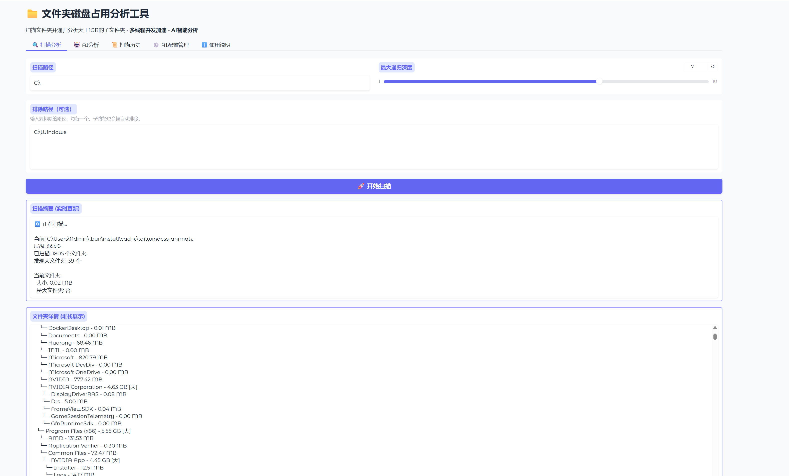
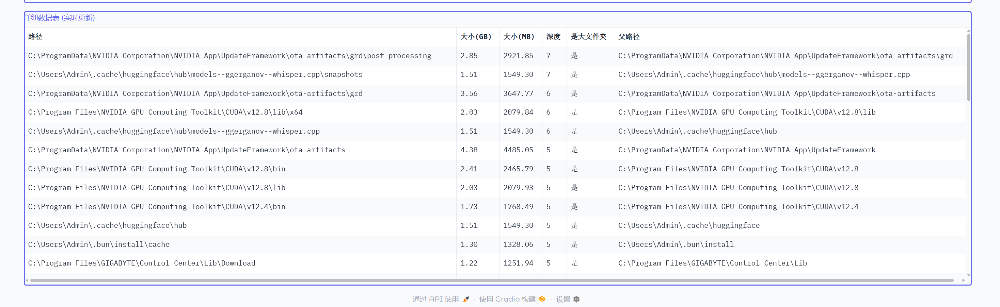
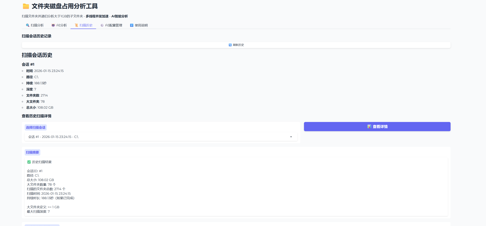

# 文件夹磁盘占用分析工具

一个基于 Python 的文件夹磁盘占用分析工具，支持递归下钻扫描大于 1GB 的文件夹，并通过 Gradio 提供 Web 界面，集成 AI 智能分析功能。

## 功能特性

- **递归下钻扫描** - 自动识别大于 1GB 的文件夹并递归扫描其子文件夹
- **多线程并发** - 使用线程池并发扫描，大幅提升速度
- **实时进度展示** - 增量展示扫描结果，进度条准确显示进度
- **AI 智能分析** - 集成 OpenAI 兼容 API，智能分析并提供清理建议
- **可配置深度** - 控制递归扫描的层级（1-10层）
- **历史记录** - 所有扫描结果保存到 SQLite 数据库
- **Web 界面** - 基于 Gradio 的友好界面
- **多种展示方式** - 树形结构、数据表格、扫描摘要

## 界面展示

### 实时扫描界面



实时扫描界面显示扫描进度，支持增量展示扫描结果，进度条准确反映当前扫描状态。

### 扫描结果展示



扫描完成后，可以查看详细的文件夹占用情况，包括树形结构、数据表格和扫描摘要等多种展示方式。

### 扫描历史记录



所有扫描结果都会保存到数据库中，可以随时查看历史记录，对比不同时间的磁盘使用情况。

### AI 智能分析结果


集成 AI 智能分析功能，自动识别可清理的文件和文件夹，提供详细的清理建议和优化方案。

## 安装

本项目使用 [uv](https://github.com/astral-sh/uv) 作为包管理器。

```bash
# 克隆项目后，安装依赖
uv sync
```

## 使用方法

### 启动 Web 界面（推荐）

```bash
uv run python main.py
```

或者：

```bash
uv run python main.py --web
```

Web 界面将在浏览器中自动打开（默认 http://127.0.0.1:7860）。

### 创建公开分享链接

```bash
uv run python main.py --share
```

## 项目结构

```
folder-clean/
├── main.py          # 主入口文件
├── models.py        # 数据模型定义
├── database.py      # 数据库操作
├── scanner.py       # 扫描器逻辑（多线程）
├── ai_analyzer.py   # AI分析模块
├── ui.py            # Gradio Web 界面
├── test.py          # 基础测试脚本
├── test_ai.py       # AI模块测试
├── pyproject.toml   # 项目配置
└── README.md        # 本文件
```

## AI 智能分析功能

### 支持的 API

本工具支持任何 OpenAI 兼容的 API：

- **OpenAI** - `https://api.openai.com/v1`
- **DeepSeek** - `https://api.deepseek.com/v1`
- **通义千问** - `https://dashscope.aliyuncs.com/compatible-mode/v1`
- **Azure OpenAI** - 你的 Azure 端点
- 其他兼容 OpenAI API 格式的服务

### AI 分析使用方法

1. 先运行扫描，获取文件夹占用情况
2. 切换到"AI 分析"标签页
3. 配置 API：
   - **API Key**: 你的 API 密钥
   - **Base URL**: API 地址（可选，默认 OpenAI）
   - **Model**: 模型名称（如 gpt-4o-mini, deepseek-chat）
4. 选择分析模式和语言
5. 点击"开始AI分析"

### AI 提供的建议

- 🎯 **高优先级清理项** - 通常可以安全删除的文件/文件夹
- ⚠️ **需要小心的项** - 删除前请检查的内容
- 🔒 **不建议删除的项** - 系统关键文件
- 💡 **优化建议** - 其他磁盘空间优化建议

## 运行测试

```bash
uv run python test.py
```

## 使用建议

1. **首次使用** - 建议从较小的目录开始测试（如用户目录）
2. **扫描整个 C 盘** - 可能需要较长时间，请耐心等待
3. **定期扫描** - 多次扫描同一路径可以观察磁盘使用变化趋势
4. **递归深度** - 推荐设置为 3-5 层，过深可能会扫描大量文件夹

## 技术栈

- Python 3.12+
- Gradio 4.0+ - Web 界面
- Pandas 2.0+ - 数据处理
- SQLite - 数据存储

## 配置

- **大文件夹阈值**: 1 GB（可在 `scanner.py` 中修改 `GB_THRESHOLD_BYTES`）
- **最大递归深度**: 5 层（可在界面中调整）
- **数据库文件**: `folder_history.db`

## 注意事项

- 扫描系统目录可能需要管理员权限
- 某些受保护的目录可能无法访问（会自动跳过）
- 扫描大量文件时可能占用较多内存
